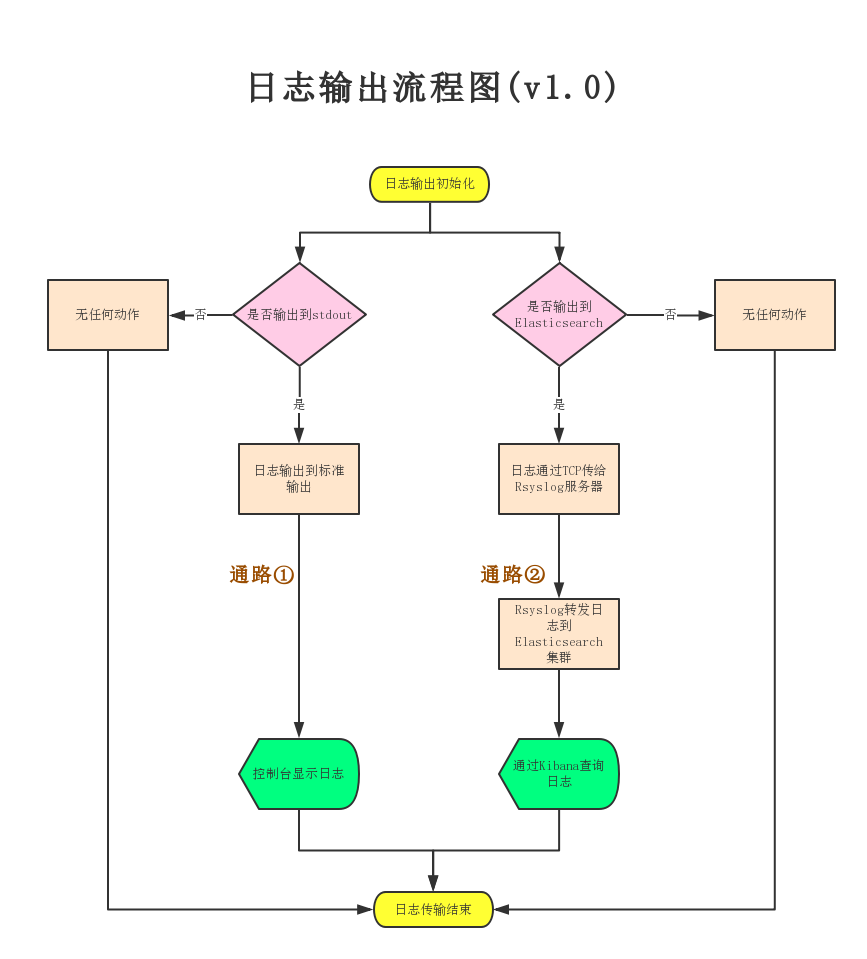
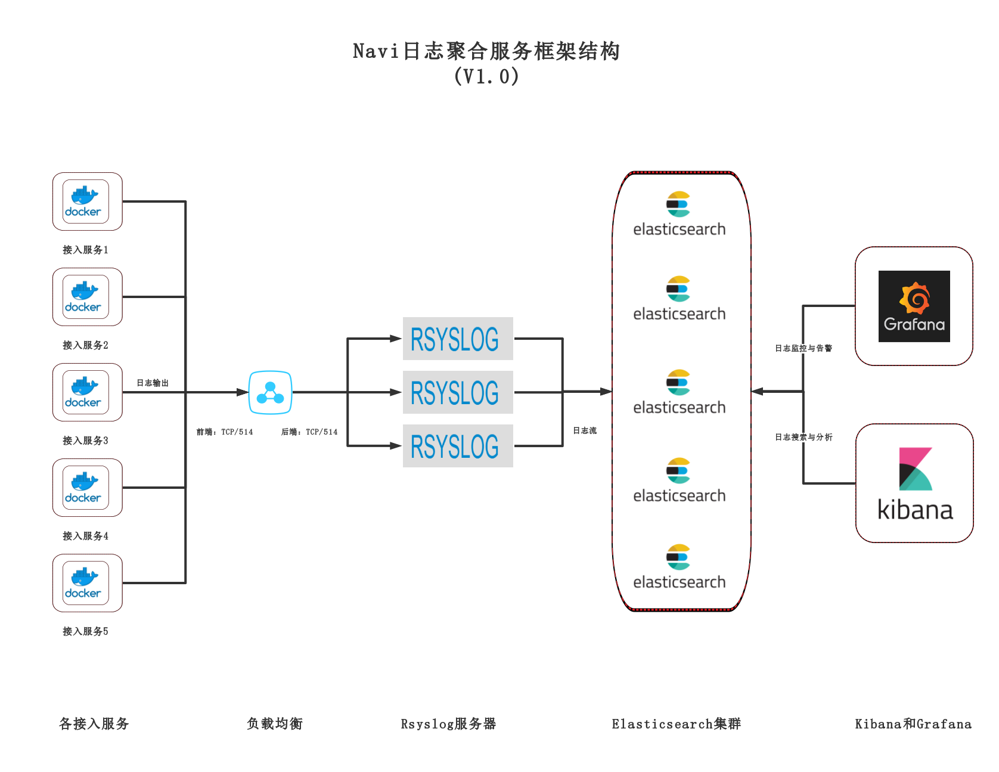

# Navi日志聚合服务

## 文档目录

- [Navi日志聚合服务](#navi日志聚合服务)
    - [服务介绍](#服务介绍)
        - [navi-go-log简介](#navi-go-log简介)
        - [日志传递](#日志传递)
        - [框架结构](#框架结构)
    - [接入流程](#接入流程)
        - [安装navi_go_log](#安装navi_go_log)
        - [配置初始化](#配置初始化)
        - [调用代码](#调用代码)
        - [日志输出函数](#日志输出函数)
    - [接入实例](#接入实例)
    - [接入地址](#接入地址)
    - [接口说明](#接口说明)
        - [初始化函数参数说明](#初始化函数参数说明)
        - [日志输出函数参数及日志字段说明](#日志输出函数参数及日志字段说明)
        - [环境变量传参](#环境变量传参)
    - [常见问题](#常见问题 )
        - [Kibana无法创建索引模式](#kibana无法创建索引模式)
    - [更新说明](#更新说明)
        - [v1.0.0 - 2018.12.14](#v100-20181214)
        - [v1.1.0 - 2018.12.18](#v110-20181218)
        - [v1.2.0 - 2018.12.18](#v120-20181218)
        - [v1.3.0 - 2018.12.25](#v130-20181225)
        - [v1.3.1 - 2019.01.11](#v131-20190111)
        - [v1.4.2 - 2019.05.06](#v142-20190506)
    - [技术支持](#技术支持 )
    
***

## 服务介绍

`Navi日志聚合服务`由Rsyslog服务器接收程序运行时生成的日志，经过相应处理后转发到Elasticsearch集群存储起来。通过Kibana可以对Elasticsearch集群中的数据进行搜索、查询、分析等操作。通过Grafana可以使用RESTful API对Elasticsearch集群中的日志数据进行监控并发出告警。

### navi-go-log简介  

`navi_go_log`是一个日志输出的SDK，使用Go语言编写，并且也只可提供给Go项目调用。该SDK可以输出Go项目程序运行过程中生成的包含message、level_name、module、tag、trace_id等属性的日志到Rsyslog并被转发到Elasticsearch中。当你在Kibana中查询时，每条日志的以上这些属性都会被单独列为Kibana中的Field（域），且在table中以表项形式显示。

### 日志传递

__日志输出流程图__：  

> 日志数据通路①：输出到控制台  
> 日志数据通路②：输出到Elasticsearch   

  

### 框架结构



## 接入流程

###  安装navi_go_log

最新的日志输出SDK版本为`v1.4.2`。  

#### 直接复制方式

从[http://192.168.1.189/navi/navi-go-log](http://192.168.1.189/navi/navi-go-log) 下载最新的代码，把`navi/navi-go-log`放在GOPATH目录下即可。  


###  配置初始化

请使用`navi_go_log`模块的初始化函数`InitLogger`进行初始化。使用容器部署时，还可以通过环境变量修改并覆盖该函数传入的配置参数（参见第3部分容器部署相关内容）。

> syslog需要在/data下创建syslog_buffer文件夹，请确保程序具备在/data下创建文件夹的权限，或者手动将文件夹的权限设置为666。  

```go
func (logger *CustomLogger) InitLogger(loggerConfig *LoggerConfig) (err error)
```

#### 初始化函数参数列表

```go
type LoggerConfig struct {
	ToStdout      bool   // 是否输出到控制台
	ToElastic     bool   // 是否输出到Elasticsearch
	LogLevel      string // 日志输出等级
	LogServerIp   string // syslog服务器IP
	LogServerPort string // syslog服务器端口
	LoggerName    string // logger名称，也即服务标签名，如data_transfer
	StdoutFormat  string // 控制台输出格式，json/custom,默认json
    SimpleLogStatus bool // 控制台简易日志开关, true/false, 默认false
}
```

| 参数名称   | 参数说明                                                     | 参数类型 | 初始值 |
| ---------- | ------------------------------------------------------------ | -------- | ------ |
| ToStdout   | 是否开启控制台打印，true打开，false关闭。                    | bool     | true   |
| ToElastic   | 是否输出到Elasticsearch（可在Kibana中查询），true打开，false关闭。 | bool     | false  |
| LogLevel   | 全局日志输出级别，同时应用于syslog日志和标准控制台输出。     | string   | INFO   |
| LogServerIp   | syslog服务器TCP地址，必须填写，非容器部署时需要使用此IP。不同环境的syslog地址不同。 | string   | ""     |
| LogServerPort | syslog服务器TCP端口，必须填写，非容器部署时需要使用此端口。一般请设置为514。 | string   | ""     |
| LoggerName | 系统日志标签，需要填写成自己服务的名称。日志中会将其值赋给@global_tag字段，用于区别不同服务。 | string   | "log_test" |
| StdoutFormat | 控制台输出格式，json/custom, 默认json，仅显示指定为custom时才以行输出。custom格式下，仅输出时间、级别、文件名、行号、信息、报错、堆栈信息。 | string | "json" |
| SimpleLogStatus | 控制台简易日志开关，默认false。支持只传入字符串。 | bool | false |

### 调用代码  

`example.go`：

```go
package main

import (
nLog "navi/navi-go-log"
	"fmt"
    "time"
)

func main()  {
    // 全局必须且仅需进行一次初始化
	nLog.Logger.InitLogger(&nLog.LoggerConfig{
		ToStdout:      true,
		ToElastic:     true,
		LogLevel:      "DEBUG",
		LogServerIp:   "192.168.26.100",
		LogServerPort: "514",
		LoggerName:    "log_test",
        StdoutFormat:  "custom"
        SimpleLogStatus: true,
	}) 
	nLog.Info(&nLog.LogRecord{
		Message: fmt.Sprintln("This is a test information."),
	})
    nLog.Info("test")
    time.Sleep(3 * time.Second) // 日志发送使用goroutine（协程），如果只发一条主进程就退出，需要sleep一下
}
```

###  日志输出函数

`nLog`为包`navi/navi-go-log`的别名，可以任意指定。

```go
nLog.Logger.InitLogger(loggerConfig *LoggerConfig)  // 全局必须且仅需进行一次初始化

nLog.Debug(logRecord *LogRecord)     // DEBUG级别日志
nLog.Info(logRecord *LogRecord)      // INFO级别日志
nLog.Warning(logRecord *LogRecord)   // WARNING级别日志
nLog.Error(logRecord *LogRecord)     // ERROR级别日志
nLog.Critical(logRecord *LogRecord)  // CRITICAL级别日志
nLog.Fatal(logRecord *LogRecord)     // FATAL级别日志
nLog.Fixed(logRecord *LogRecord)     // FIXED级别日志
```

## 接入实例

数据传输平台。

## 接入地址

|     环境     |      Rsyslog       |                      Elasticsearch                       |                          Kibana                          |                         Grafana                          |
| :----------: | :----------------: | :------------------------------------------------------: | :------------------------------------------------------: | :------------------------------------------------------: |
| 内网测试环境 | 192.168.26.100:514 | [http://192.168.26.100:9200](http://192.168.26.100:9200) | [http://192.168.26.100:5601](http://192.168.26.100:5601) | [http://192.168.26.100:3000](http://192.168.26.100:3000) <br>账号：admin<br>密码：admin123456 |

## 接口说明

### 初始化函数参数说明

参阅：[初始化函数参数列表](#初始化函数参数列表)  

### 日志输出函数参数及日志字段说明

日志输出函数传入参数为一个结构体`LogRecord`。

```go
// 允许设置的log内容
type LogRecord struct {
	Message    string    `json:"message,omitempty"`  
	Tag        string    `json:"tag"`
	TraceId    string    `json:"trace_id,omitempty"`
	ExcInfo    string    `json:"exc_info,omitempty,string"`
	Extra      *ExtField `json:"extra,omitempty"`
}
```


| 参数名称          | 日志字段   | 参数说明 | 参数类型 | 必传 | 其它说明 |
| ----------------- | ---------- | -------- | -------- | ---- | ---- |
|         无          | level_name | 日志级别（日志类型分类） | int<br> (10:DEBUG<br> 20:INFO <br>30:WARNING<br> 40:ERROR <br>50:CRITICAL<br>60:FATAL<br>100:FIXED) | 是 | 调用不同级别的日志输出函数时，自动生成。 |
|          无         | log_time   | 日志时间 | string | 是 | 自动生成 |
|            无       | filename   | 文件名 | string | 是 | 自动生成 |
|            无       | module     | 模块名 | string | 是 | 自动生成 |
|              无     | line_no   | 行号 | int | 是 | 自动生成 |
|              无     | func_name  | 函数名 | string | 是 | 自动生成 |
|        logRecord.Message           | message    | 日志内容 | string | 是 | 需手动填写 |
| logRecord.Tag | tag        | 内部日志标签（同一服务允许多个不同的标签，用于区分不同主题） | string | 否 | 需手动填写，默认值为root |
| logRecord.TraceId | trace_id   | 追踪标识（用于追踪服务调用链） | string | 否 | 需手动填写 |
| logRecord.ExcInfo | exc_info   | 异常信息 | string | 否 | 需指定异常或错误信息的对象 |
| 无 | stack_info | 调用堆栈 | string | 否 | exc_info有异常时自动生成 |
| LogRecord.Extra | extra | 扩展字段 | *ExtField | 否 | 可添加任意字段。其中，`type ExtField map[string]interface{}` |
|无|@global_tag|全局日志标签（同一服务使用唯一标签）|string|是|由配置结构体LoggerConfig的LoggerName字段指定|

### 环境变量传参

为了方便容器部署时通过环境变量传入日志初始化配置参数，模块中已内置环境变量传参方式，请使用如下命名。这些环境变量将会覆盖初始化参数。

|    环境变量     | 默认值 | 取值范围/示例                     |                参数说明                 |
| :-------------: | :----: | --------------------------------- | :-------------------------------------: |
|  LOG_TO_STDOUT  |  YES   | YES/NO                            |           是否打印到控制台。            |
| LOG_TO_ELASTIC  |   NO   | YES/NO                            |        是否发送到Elasticsearch。        |
|    LOG_LEVEL    |  INFO  | DEBUG/INFO/WARNING/ERROR/CRITICAL |               日志级别。                |
|   LOGGER_NAME   |   无   | 任取                              | Elasticsearch索引前缀，请设置为服务名。 |
|  LOG_SERVER_IP  |   无   | 192.168.26.100                    |            Rsyslog服务器IP。            |
| LOG_SERVER_PORT |  514   | 端口号                            |           Rsyslog服务器端口。           |
|  STDOUT_FORMAT  |  json  | json/custom，其余值均视为json     |            控制台输出格式。             |
|  SIMPLE_LOG_ON  |   NO   | YES/NO                            |        是否开启控制台简易日志。         |

请在`Dockerfile`中添加环境变量并设置默认值，运行容器时需要覆盖默认值使用形如`docker run -e LOG_TO_STDOUT="NO" -e LOG_TO_ELASTIC="YES" ...` 命令。

```dockerfile
...
ENV LOG_TO_STDOUT=YES \
    LOG_TO_ELASTIC=NO \
    LOG_LEVEL=DEBUG \
    LOGGER_NAME=es_test \
    LOG_SERVER_IP=192.168.26.100 \
    LOG_SERVER_PORT=514 \
    STDOUT_FORMAT=json
...
```

## 常见问题  

### Kibana无法创建索引模式

在Kibana上创建索引模式（`Index Pattern`）时，需要在Elasticsearch已经存储有相关数据。如果报`Unable to fetch mapping. Do you have indices matching the pattern?`，且下方没有Create键或者Create键是暗的，说明，该标签的日志或数据并没有传送给Elasticsearch，或者Elasticsearch中从始至终尚没有相关索引的数据存入。请检查你的索引名是否正确，或者你的项目是否正常运行。

## 更新说明  

### v1.0.0 - 2018.12.14

* __异步处理和流量削峰__：日志生成后放入缓存队列并立即返回。
* __批量发送__：缓存队列大小达到批量值或超出一定时间仍未达批量值，自动发送一批日志。
* __失败重发__：因各种异常导致日志发送失败时，写入文件。每隔一段时间扫描文件重新发送。  
* __高峰应急__：流量高峰期时，缓存队列超过阈值将启动写文件机制并于适当时候扫描重发。
* __容器部署配置管理__：支持通过环境变量传入日志初始化配置全部参数。

### v1.1.0 - 2018.12.18

* __新增FATAL级别日志__：打印最后的日志，程序自动退出。

### v1.2.0 - 2018.12.18

* __添加控制台输出格式选择__：json格式或定制格式(custom)。

### v1.3.0 - 2018.12.25

* __添加简易日志输出__：调用时可只传入字符串。

### v1.3.1 - 2019.01.11

* __完善简易日志输出__：调用时若传入非string或LogRecord类型，自动转换为字符串输出。

### v1.4.2 - 2019.05.06

* __修复多种log调用参数下skip层级不同的问题__。
* __完善控制台输出颜色__。

## 技术支持  

|               部门 - 小组                | 姓名 |       联系方式       |
| :--------------------------------------: | :--: | :------------------: |
| 人工智能引擎平台研发中心- 基础平台研发组 | 黄福林  | huangfl@kuanshang.com.cn |

